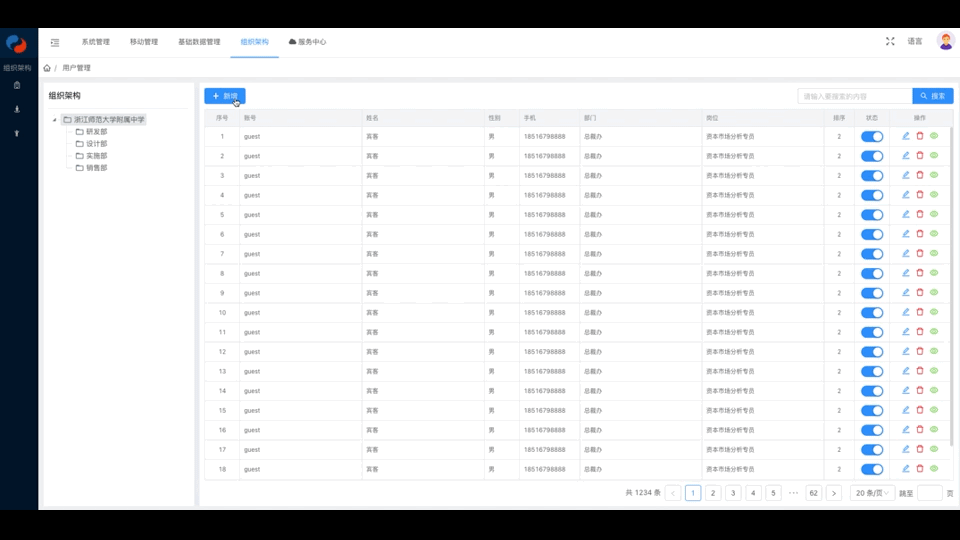

# 卷轴式动画弹窗
一个支持卷轴式展开、关闭的Vue弹窗组件

### 效果演示
- 温馨提示：由于录制问题，动画可能出现卡顿，实际使用不存在此问题~


### 使用方式
1. 安装
```
npm i -S scroll-modal
```

2. 使用
```vue
<template>
<!-- 组件根元素 -->
<div style="position: relative">
  <!-- 这里填充组件的其他元素 -->

  <scroll-modal ref="scrollModal">
    <!-- 这里填充弹窗内容 -->
  </scroll-modal>
</div>

</template>

<script>
import ScrollModal from 'scroll-modal'

export default {
  components: {
    ScrollModal
  },
  methods: {
    /**
    * 展开弹窗
    */
    openScrollModal: function () {
      this.$refs.scrollModal.open()
    },
    /**
    * 关闭弹窗
    */
    closeScrollModal: function () {
      this.$refs.scrollModal.close()
    },
  }
}
</script>
```
